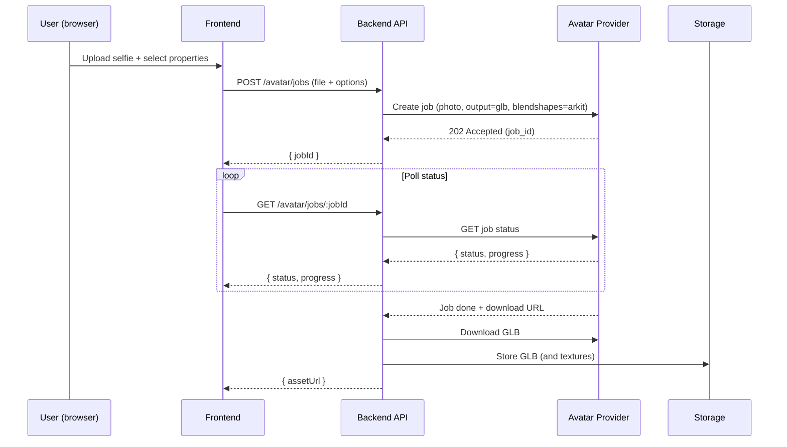
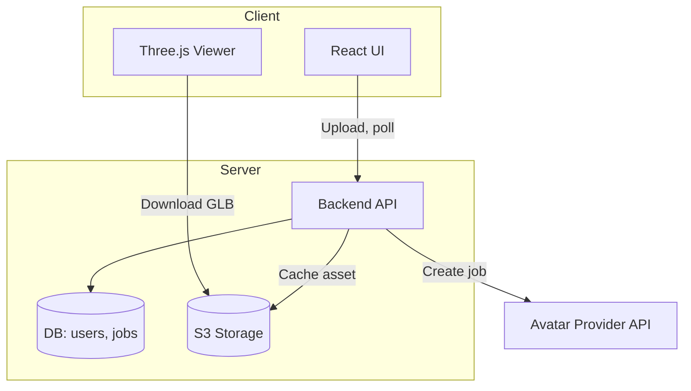

# Architecture and Flows — Photoreal Avatar Route

## High-Level Components
- Frontend (Web/PWA): React + Three.js viewer, questionnaire, upload
- Backend API: Node/Express or FastAPI; avatar job proxy; storage; auth (optional)
- Avatar Provider: Avatar SDK / in3D / Didimo (trial)
- Storage: S3-compatible bucket for GLB + textures

## Data Flow (Avatar Generation)



## Data Flow (Viewing in Browser)

```mermaid
sequenceDiagram
  participant FE as Frontend
  participant S3 as Storage
  participant BE as Backend

  FE->>BE: GET /avatar/assets/:id (signed URL)
  BE->>S3: Generate signed URL
  S3-->>BE: URL
  BE-->>FE: URL
  FE->>S3: GET model.glb
  FE: Three.js GLTFLoader → render
```

## Component Diagram



## Minimal Blendshape/Viseme Contract (for later lip-sync)
- Ensure provider exports ARKit‑style shapes or name mapping table
- Example minimal set we will use:
  - jawOpen, mouthFunnel, mouthPucker, mouthSmile, mouthClose
  - eyeBlinkLeft, eyeBlinkRight, browInnerUp

## Performance Budget (mobile‑friendly)
- Geometry: 100–200k triangles
- Textures: 2–4k max; KTX2 compression
- GLB size target: < 20 MB (ideally 8–12 MB)
- FPS: 30–60 on mid‑range Android

## Security/Privacy
- Store explicit consent with selfie upload (checkbox + timestamp)
- Delete raw photos after job completion
- Signed URLs for GLB access
- Age confirmation (18+)


